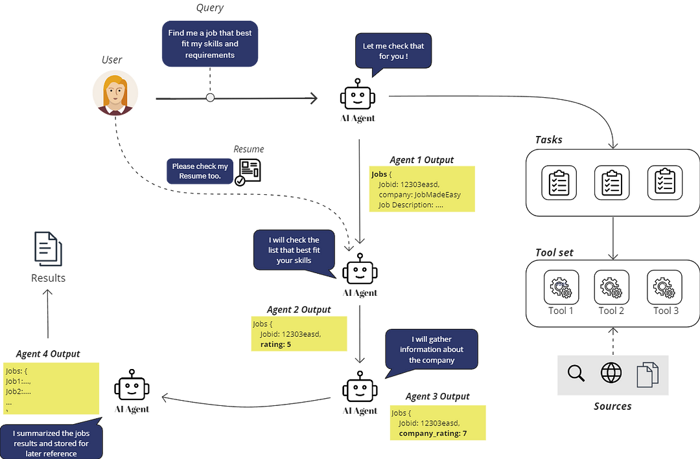

# Project Overview

## Description

Project full description available at: 


## Project Structure Overview



## Key Components

- **`configs/`**: Contains configurations for agents that dynamically adjust their behavior based on project needs.
- **`data/`**: Houses essential data files like sample jobs and resumes for testing and demonstration purposes.
- **`models/`**: Includes sophisticated data models that support robust data interaction and manipulation.
- **`utils/`**: Provides utility functions that enhance functionality and simplify repetitive operations across the project.
- **`agents_factory.py` and `tasks_factory.py`**: These scripts implement factory patterns to efficiently create instances as per the configuration specified.
- **`main.py`**: The main script that serves as the entry point, bringing together various components and driving the application.

## Installation

To set up this project locally, follow these steps:

1. Clone the repository:
   ```bash
   git clone https://github.com/Husseinjd/job-search-2.0.git

2. Install the required dependencies:
   ```bash
   pip install -r requirements.txt

3. Set up the environment variables:
   ```bash
   cp .env.example .env

4. Run the application
   ```bash
    python main.py
